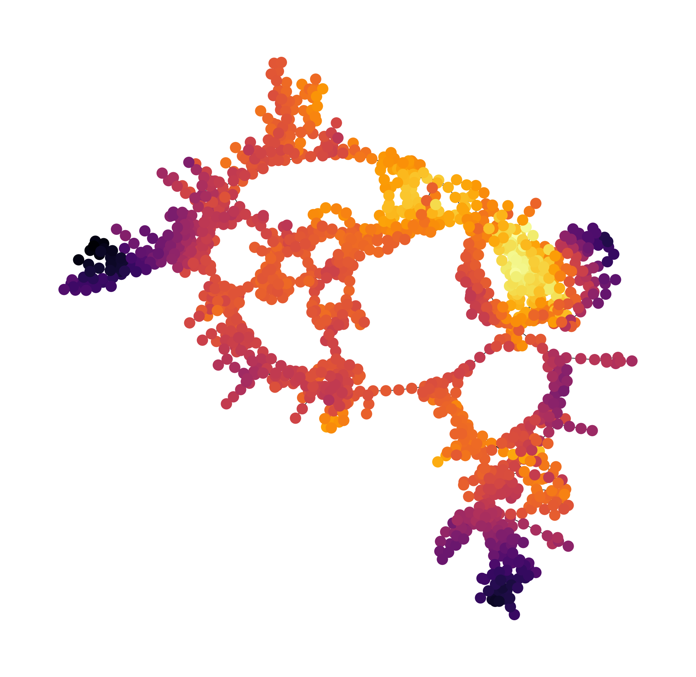

# Energy Based Clustering

Implementation of the clustering algorithm described in:

"Energy Based Clustering: Fast and Robust Clustering of Data with Known Likelihood Functions"



## Contents

- [Energy Based Clustering](#energy-based-clustering)
  - [Contents](#contents)
  - [Installation](#installation)
  - [Inputs](#inputs)
  - [Usage](#usage)
  - [Parameters](#parameters)
    - [Performance](#performance)
  - [Requirements](#requirements)
  - [Citation](#citation)
  - [License](#license)

## Installation

```sh
git clone https://github.com/MOSNPDEV/EnergyBasedClustering.git
cd EnergyBasedClustering-main
pip install .
```

## Inputs

coordinates [NxD(float)]: NxD array of coordinates.

energies [N(float)]: N array of energies or negative log-likelihoods.

temperature [float]: Hyperparameter controlling 'smoothness' of potential energy surface/relative weights. temperature=np.std(energies) is a good starting point.

n_clusters [int] (optional): Number of clusters you want to extract based on the spectrum. Only required if you want to extract cluster labels. Can also be set after an initial visual inspection of the connectivity with plot_graph() (see below).

Additional details and examples can be found below or in source/examples.

## Usage

```sh
from EBC import EBC
ebc = EBC(n_clusters=n) 
labels = ebc.fit_transform(coordinates, energies)
ebc.show()
```

you can obtain the labels to the clusters ('proto clusters') as

```sh
ebc.proto_labels
```

or

```sh
ebc.state_labels
and
ebc.labels
```

if you want to know the label of each input sample (i.e. same number as coordinates).

You can also look at the connectivity between states

```sh
ebc.plot_graph()
```

which can help inform n_clusters. For plot_graph(), tau [int] will control the timescale.

If you want to change the number of clusters, simply run

```sh
ebc.extract_clusters(n_clusters=n_clusters)
```

extracted clusters can be inspected with

```sh
ebc.show()
```

Finally,

```sh
ebc.hierarchical()
```

will apply the free-energy hierarchical clustering, showing how the minima of your PES merge.

## Parameters

The most important parameters you have to set:

n_clusters [int]: Self-explanatory, will control the number of clusters you obtain, i.e. the number of eigenvectors used.

temperature [float]: Controls the relative depth of energy minima. It might be worth to scan a range of temperatures. A good starting point is T=std(energies).

boxsize [float] or [array(floats)]: Can be used to introduce periodic boundary conditions. Please note that only intervals [0, x) are supported.

All other parameters are estimated. The size of the proto clusters can play an important role, if you think the proto clusters are too fine/coarse you can either control it directly using

proto_radius [float]: Control the radius of the proto clusters.

or by setting

percentile [float] (0-100): Will change the percentile which is used to estimate the proto cluster radius.

### Performance

The performance depends largely on the number of proto clusters. We found that for most datasets, 1K is a good starting point. For ~1K it should not take longer than a second. If you are not happy with the speed, you can experiment with the following parameters:

percentile: A larger percentile will results in larger radii which will result in a smaller number of proto clusters
proto_radius: Similarly, a larger proto radius will decrease the number of proto clusters.

An implementation using sparse matrices is provided and used by default. This can provide huge speed ups if the number of proto clusters is larger than a few hundred. However, depending on your dataset, i.e. if there are disconnected components, the sparse implementation can result in numerical instabilities.

You can try it out with:

use_sparse [bool]: Uses the sparse matrix implementation.

The sparse matrix implementation benefits from using a small number of nearest neighbours which can be controlled with

knn [int]: Number of nearest neighbours used to construct the diffusion matrix.

In general, you can also consider subsampling your data. The algorithm should be robust as long as your state space is still sufficiently sampled.

Finally, you can also consider including a distance based weight by setting

mode [str] ('knn'|'knnr'): 'knn' assume that the distance based contribution is negligible within a small neighbourhood. 'knnr' introduce a distance based weight. Decay of the distance based weighting function (Gaussian) can be controlled with gamma.

## Requirements

The module was tested on the following versions (see environment.yml):

- Python3 (3.9)
- Numpy (1.19.5)
- Matplotlib (3.5.3)
- Scipy (1.9.0)
- Sklearn (1.0.1)
- Networkx (2.8.8)

Exact versions shouldn't matter too much except for Scipy which should use a version with the new sparse array API (1.8+).

## Citation

Please cite the corresponding publication:

## License

MIT
